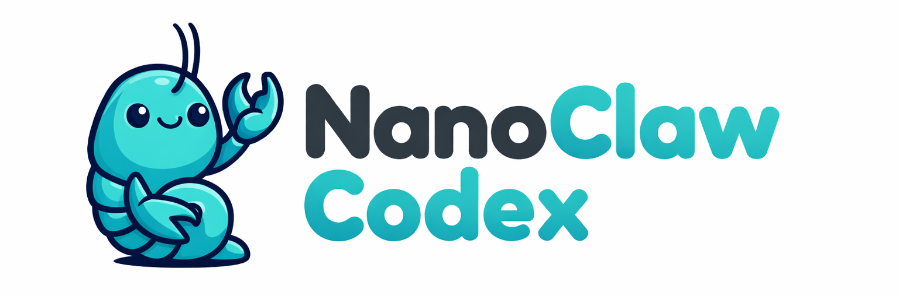

<p align="center">
  
</p>

<p align="center">
  A personal AI assistant that runs Codex in per-group local sandboxes.
</p>

<p align="center">
  <a href="https://nanoclaw.dev">nanoclaw.dev</a>&nbsp; • &nbsp;
  <a href="README_zh.md">中文</a>&nbsp; • &nbsp;
  <a href="https://github.com/GaussianGuaicai/nanoclaw-codex">Fork</a>&nbsp; • &nbsp;
  <a href="https://discord.gg/VDdww8qS42"></a>&nbsp; • &nbsp;
  <a href="repo-tokens"></a>
</p>

This fork keeps NanoClaw's small-core, skill-first host architecture, but replaces the old container runtime with a local Codex sandbox worker. The host process still handles channels, routing, scheduling, group state, and IPC. Codex now runs directly on the host with per-group `CODEX_HOME`, group-scoped workspaces, and host-prepared writable roots or snapshots.

## What This Fork Changes

- Removes Anthropic runtime support and standardizes on Codex
- Replaces container lifecycle management with a local worker process using `@openai/codex-sdk`
- Keeps per-group session state in `data/sessions/{group}/.codex`
- Preserves task scheduling, IPC tools, and skill-based channel installation
- Keeps `containerConfig` as a compatibility input, but maps it to sandbox writable roots or read-only snapshots

## Why NanoClaw

[OpenClaw](https://github.com/openclaw/openclaw) is an impressive project, but I wanted a codebase small enough to audit and fork directly. NanoClaw keeps the core loop understandable: one Node.js process, a few source files, and explicit host-side control over what each group can see.

## Quick Start

```bash
git clone https://github.com/GaussianGuaicai/nanoclaw-codex.git
cd nanoclaw-codex
brew install codex
# or: npm install -g @openai/codex
mkdir -p .agents
ln -s ../.claude/skills .agents/skills
codex
```

Then run `$setup`.

The setup flow is still skill-driven. It installs dependencies, configures channels, and writes service configuration.

> **Note:** In Codex, invoke repo skills with a `$` prefix, such as `$setup`, `$add-whatsapp`, and `$customize`. Codex scans `.agents/skills`, while this repository still stores its skill packages in `.claude/skills`, so you currently need the `.agents/skills -> ../.claude/skills` symlink shown above. Codex supports symlinked skill directories.

## Runtime

NanoClaw is now Codex-only.

Required `.env` keys:

```bash
OPENAI_API_KEY=sk-...
# Optional
OPENAI_BASE_URL=https://your-openai-compatible-endpoint.com
NANOCLAW_CODEX_MODEL=gpt-5-codex
NANOCLAW_CODEX_SANDBOX_MODE=workspace-write
NANOCLAW_CODEX_APPROVAL_POLICY=never
NANOCLAW_CODEX_NETWORK_ACCESS=true
NANOCLAW_CODEX_WEB_SEARCH_ENABLED=false
NANOCLAW_CODEX_WEB_SEARCH_MODE=disabled
NANOCLAW_CODEX_REASONING_EFFORT=medium
```

Per-group Codex state lives under `data/sessions/{group}/.codex`. That directory is used as `CODEX_HOME`, so each group gets isolated session history, auth state, logs, and local Codex metadata.

## Sandbox Model

- Main group:
  - working directory: `groups/main/`
  - read-only snapshot of project root (with `.env` stripped)
- Non-main groups:
  - working directory: their own `groups/{folder}/`
  - no automatic access to project root
- `containerConfig.additionalMounts` compatibility:
  - `readonly !== false`: copied into a per-group snapshot directory before each run
  - `readonly === false`: allowed only when the external mount allowlist permits it, then exposed as an extra writable root

The runtime defaults to `workspace-write` sandbox mode with `approval_policy=never` and network enabled. This matches NanoClaw's unattended chat/task model: the host cannot pause for interactive sandbox approvals mid-turn.

## What The Core Ships With

- Group-isolated memory via `groups/*/AGENTS.md`
- Per-group Codex session state via `data/sessions/*/.codex`
- Scheduled tasks that run through the same local worker
- File-based IPC between the host orchestrator and the worker MCP server
- Skill-based channel installation (`$add-whatsapp`, `$add-telegram`, `$add-slack`, `$add-discord`, `$add-gmail`)

The core intentionally does not bundle channel implementations. Channels are added by skills that patch `src/channels/` and self-register at startup.

## Requirements

- macOS or Linux
- Node.js 20+
- [Codex CLI](https://developers.openai.com/codex/quickstart/) for `$setup`, `$customize`, and the host-side skill workflow
- ChatGPT Plan or `OPENAI_API_KEY` for Codex runtime access

Docker and Apple Container are no longer required.

## Development

```bash
npm run dev
npm run build
npm test
```

`npm run build` now compiles both the host TypeScript project and the local worker under `container/agent-runner/`.

## Architecture

```text
Channels --> SQLite --> Polling loop --> Local worker runner --> Codex SDK --> Response
```

Single Node.js process. Installed channels self-register at startup. The orchestrator connects whichever channels have credentials present, queues work per group, prepares group-specific sandbox inputs, and spawns a local Codex worker process. The worker starts Codex with:

- a per-group `CODEX_HOME`
- a group working directory
- host-selected additional writable roots
- a local MCP server for messaging and scheduling tools

Key files:

- `src/index.ts` - Orchestrator: state, message loop, agent invocation
- `src/container-runner.ts` - Host-side worker launch, sandbox layout prep, stdout parsing
- `src/ipc.ts` - IPC watcher and task processing
- `src/task-scheduler.ts` - Scheduled task execution
- `src/db.ts` - SQLite operations
- `container/agent-runner/src/index.ts` - Local worker entrypoint
- `container/agent-runner/src/runtime/codex-runtime.ts` - Codex runtime implementation
- `container/agent-runner/src/ipc-mcp-stdio.ts` - MCP tools exposed to Codex
- `groups/*/AGENTS.md` - Per-group memory

## Security

The main security boundary is now Codex sandbox policy plus host-side directory orchestration, not Linux VM/container isolation.

- Main group can edit the repo root.
- Non-main groups are limited to their own group directory plus any host-approved extra roots or snapshots.
- Extra writable roots are validated against an external allowlist at `~/.config/nanoclaw/mount-allowlist.json`.
- The host still owns channel auth, sender allowlists, scheduling state, and IPC authorization.

See [docs/SECURITY.md](docs/SECURITY.md) for the current model.

## FAQ

**Do I still need Claude Code if runtime is Codex?**

No. The recommended host workflow is now Codex: install the Codex CLI, create the `.agents/skills` symlink, open the repo with `codex`, and run repo skills with `$setup`, `$customize`, and the other `$skill-name` commands.

**Can I use self-hosted OpenAI-compatible endpoints?**

Yes:

```bash
OPENAI_BASE_URL=https://your-openai-compatible-endpoint.com
OPENAI_API_KEY=your-token-here
```

**Is this as isolated as the old container version?**

No. The old fork relied on container isolation. The current fork accepts a weaker but simpler model: Codex `workspace-write` sandbox plus host-controlled writable roots and snapshots.

**How do I debug issues?**

Inspect `groups/*/logs/`, scheduler state, IPC snapshots under `data/ipc/`, and the worker implementation under `container/agent-runner/`.

## Contributing

**Prefer skills over core bloat.**

If you want to add Telegram support or another integration, contribute the skill that teaches the coding agent how to patch NanoClaw, rather than permanently growing core. At the moment, repo skills still live under `.claude/skills`, so keep the `.agents/skills` symlink requirement in mind when documenting or testing them with Codex.

## Community

Questions? Ideas? [Join the Discord](https://discord.gg/VDdww8qS42).

## Changelog

See [CHANGELOG.md](CHANGELOG.md) for breaking changes and migration notes.

## License

MIT
